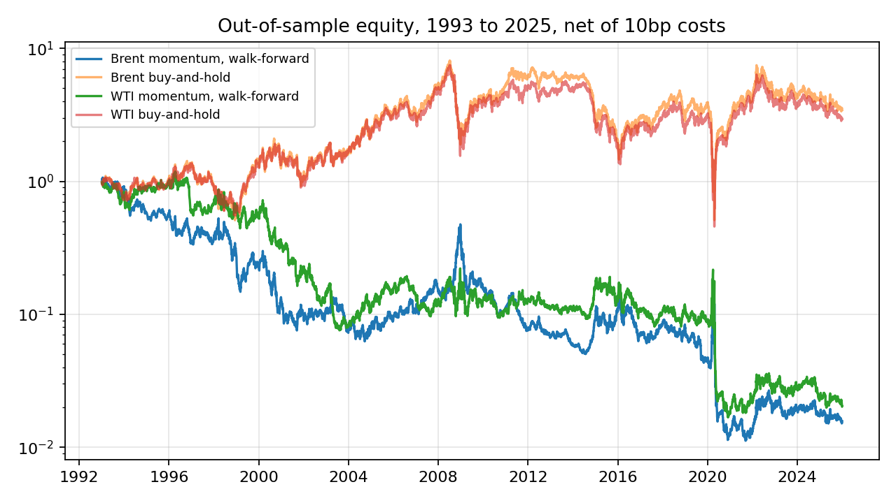

# Oil Momentum Walk-Forward Study

**Arvind Thandi**

A pre-registered test of whether a simple time-series momentum rule beats buy-and-hold on daily Brent and WTI spot prices, out of sample and after costs, with the lookback re-chosen every year using only past data. The design was fixed in [PREREGISTRATION.md](PREREGISTRATION.md) before any result was computed, and the results below are reported as they came out.

## Result

It doesn't. Across 33 out-of-sample years (1993 to 2025), momentum lost to buy-and-hold on both markets.

| | Brent momentum | Brent buy-and-hold | WTI momentum | WTI buy-and-hold |
|---|---|---|---|---|
| Annualised return | -13.0% | 4.2% | -12.1% | 3.6% |
| Annualised Sharpe | -0.12 | 0.31 | -0.05 | 0.31 |
| Maximum drawdown | -99.0% | -93.7% | -98.6% | -93.9% |
| Years momentum beat buy-and-hold | 11 of 33 | | 12 of 33 | |

The lookback chosen each year looked good on the data it was chosen from and not afterwards. On Brent its average in-sample Sharpe was 0.215, and its average out-of-sample Sharpe was -0.084: the same selection optimism my QuantLab pair-mining study found. The 95% block-bootstrap interval for the Sharpe difference (momentum minus buy-and-hold) is -1.04 to 0.18 on Brent and -0.84 to 0.11 on WTI, so the loss is consistent but not statistically decisive.



## Limitations, stated plainly

- **Spot prices, not futures.** Nobody can hold spot oil, so buy-and-hold here ignores roll yield, storage and carry. The study measures whether trailing direction forecasts spot direction. It is not a tradeable backtest. The obvious next step is the same test on a continuous front-month futures series.
- **One rule family.** Only sign-of-trailing-return momentum with four lookbacks was tested, by design. Other rules were not tried, so this says nothing about them.
- **Illustrative costs.** 10 basis points per unit of turnover is an assumption, not a measured cost.
- **WTI's negative price** on 20 April 2020 was excluded under the pre-registered data rule.

## Run it

```bash
pip install -r requirements.txt
python -m pytest -q        # 6 tests: no look-ahead, previous-close signal, flip costs, walk-forward isolation, data rule, metrics
python energy_wf.py        # writes outputs/summary.json, outputs/folds_brent.csv, outputs/folds_wti.csv, outputs/equity_curves.png
```

Data: U.S. Energy Information Administration daily spot prices via the public datasets/oil-prices repository, snapshot to 22 September 2026.

MIT License, copyright 2026 Arvind Thandi.
